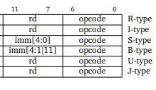
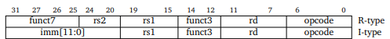
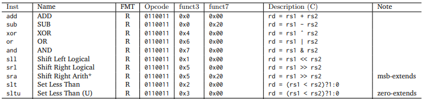
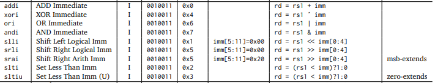
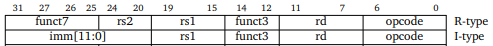
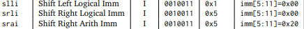

# Estructuras de datos (primer examen)

## Introducción

Para este examen usted requerirá de alguna documentación y de algo de código
fuente que estará disponible como parte del repositorio donde se encuentra este
archivo.

Este trabajo está diseñado para ser realizado en parejas. Es decir, grupos de
máximo dos estudiantes. Al respecto es necesario aclarar que en cualquier caso
se puede requerir una sustentación. En esas circunstancias la nota del trabajo
será la nota de la sustentación. Por tratarse de un trabajo en grupos ambos
integrantes deben estar en total capacidad de llevar a cabo la sustentación e
igual la nota será grupal.

## Ensamblador para RISCV

El trabajo consiste en la implementación de un ensamblador para el conjunto de
instrucciones de RISCV32IM. Un ensamblador es un programa que traduce código
fuente como el siguiente:

```assembly
main:
    addi x4, zero, 50
    addi x5, zero, 50
    beq x4, x5, label1
    addi x6, zero, 80
    beq zero, zero, label2
    

label1:
    addi x6, zero, 100

label2:
    add zero, zero, zero
```

en un archivo con el siguiente código:

```
03 20 02 13 03 20 02 93 00 52 06 63 05 00 03 13 
00 00 04 63 06 40 03 13 00 00 00 33 00 00 00 00 
00 00 00 00 00 00 00 00 00 00 00 00 00 00 00 00 
00 00 00 00 00 00 00 00 00 00 00 00 00 00 00 00 
00 00 00 00 00 00 00 00 00 00 00 00 00 00 00 00 
00 00 00 00 00 00 00 00 00 00 00 00 00 00 00 00 
00 00 00 00 00 00 00 00 00 00 00 00 00 00 00 00 
00 00 00 00 00 00 00 00 00 00 00 00 00 00 00 00 
00 00 00 00 00 00 00 00 00 00 00 00 00 00 00 00 
00 00 00 00 00 00 00 00 00 00 00 00 00 00 00 00 
00 00 00 00 00 00 00 00 00 00 00 00 00 00 00 00 
```

Es de anotar que la salida no es exactamente esa, fue recortada para que no
ocupara tanto espacio en el documento.

Al programa de arriba lo llamaremos el programa de entrada y al de abajo lo
llamaremos el programa de salida para los efectos de ésta tarea. Entonces
básicamente lo que usted debe presentar es un programa que tome como entrada un
archivo conteniendo código de ensamblador como el de arriba y escriba como
salida un archivo con código como el de abajo.

Lo único que queda entonces es establecer es cómo cada línea del programa de
arriba debe quedar representada en el archivo de salida. Para que el desarrollo
de este ensamblador no luzca en exceso complicado, será descrito por medio de
ejercicios. Estos irán incorporando cambios sobre su programa de manera
incremental hasta terminar en un ensamblador completo.

## Ejercicio 1

En esta primera parte usted va a realizar un programa en C/C++ que lea un
archivo de entrada y escriba en un archivo de salida de la siguiente forma:

Cada línea no vacía de la entrada puede ser de una de las siguientes entidades:

- _Etiquetas_:  marcan el inicio de una sección dentro del programa.  
- _Instrucciones_: son las que finalmente serán traducidas.
- _Directivas_:  son opciones que no pertenecen al lenguaje de programación
   pero que afectan la forma como quedará el archivo de salida.
- _Comentarios_: son anotaciones de código que no tienen relevancia durante
   la ejecución.

1. Los comentarios deben ser ignorados y no deben ir en el archivo de salida.
2. Las directivas también serán ignoradas por ahora.
3. Por cada instrucción debe aparecer en el archivo de salida una línea de 32
   bits (binario) con solamente ceros. Exceptuando la parte del código de
   operación, el cual si debe coincidir con los códigos presentados en

## Ejercicio 2

Para este momento usted ya debe contar con una implementación que, a partir de
un archivo de entrada como el siguiente:


```assembly
main:
    addi x4, zero, 520
    addi x5, zero, 1550
    beq x4, x5, label1
    addi x6, zero, 80
    beq zero, zero, label2
    

label1:
    addi x6, zero, 100

label2:
    add zero, zero, zero
```

produce lo siguiente en el archivo de salida.

```
00 00 00 00 00 00 00 00 00 00 00 00 0  0010011    
00 00 00 00 00 00 00 00 00 00 00 00 0  0010011    
00 00 00 00 00 00 00 00 00 00 00 00 0  1100011    
00 00 00 00 00 00 00 00 00 00 00 00 0  0010011    
00 00 00 00 00 00 00 00 00 00 00 00 0  1100011    
00 00 00 00 00 00 00 00 00 00 00 00 0  0010011    
00 00 00 00 00 00 00 00 00 00 00 00 0  0110011    
```

Note que hay una separación con los últimos 7 valores en cada instrucción. Esto
es simplemente para facilitar la lectura pero tal separación no va en el archivo
de salida. Los datos de la última "columna" (por llamarla de alguna forma)
corresponden al código de operación de cada instrucción del archivo de entrada.
Note también que las etiquetas no están presentes. De esas se encargará más
adelante.

Ahora lo que debe hacer es modificar su programa para adicionar la siguiente
funcionalidad.

Casi todas las instrucciones tienen un registro destino, esto se puede apreciar
en la siguiente imagen.



Como se puede apreciar en la figura anterior, a excepción de las instrucciones
del tipo _S_ y _B_, las demás tienen un campo _rd_. En esta parte usted
adicionará la codificación de este campo en la salida. Para este momento usted
ya habrá considerado que cada instrucción en una cadena de texto se puede
representar de una mejor manera. Por ejemplo, una secuencia con la información
realmente importante.

Por ejemplo, en la instrucción ` addi x4, x10, 520` lo realmente importante es
la información presente en la secuencia:

 $$I=\langle \text{addi}, x4, x10, 520\rangle$$
 

Asimismo se puede hacer con cualquiera de las otras instrucciones
sin importar su tipo.

Esta notación luce mucho mejor y usted cuenta con estructuras de datos que le
van a facilitar el trabajo. Teniendo cada instrucción en una estructura de datos
y otra estructura de datos que contenga todas las instrucciones luce como una
buena representación del archivo de entrada. De esta manera lo que usted hará en
adelante es simplemente procesar esta gran estructura para realizar todas las
conversiones.

El resultado de este ejercicio es entonces una gran secuencia de instrucciones,
donde cada instrucción es a su vez, una secuencia como la del ejemplo anterior.
Adicionalmente usted recorrerá esta gran secuencia para realizar la codificación
del campo _rd_ en las instrucciones que lo tengan. Esto lo escribirá en el
archivo de salida.

## Ejercicio 3

Como producto del ejercicio anterior usted ya debe contar con todos los datos de
las instrucciones en una estructura de datos. Esta estructura usted la eligió
teniendo en cuenta sus conocimientos pero si ve la necesidad la puede cambiar
más adelante. Lo importante es ir revisando las necesidades que se presentan y
de ser necesario realizar los camios o ajustes necesarios.

Adicionalmente ya debe estar familiarizado con el tratamiento del archivo de
entrada y por ende ya debe estar en capacidad de codificar cualquier instrucción
de tipo _R_.


Hay instrucciones que tienen constantes o, como también las llamaremos, valores
inmediatos. Por ejemplo las instrucciones tipo _I_ son de ese grupo.  En el caso
de estas instrucciones es necesario codificar las constantes. Este proceso es
simple pero requiere de algunas consideraciones. Las constantes de este grupo
deben ser representables en 12 bits.



Note que la única diferencia entre los dos tipos de instrucciones es la
constante o valor inmediato. Para codificar esta parte debe tener en cuenta dos
aspectos: 

1. La constante de caer en 12 bits y de no ser el caso su programa debe fallar
   reportando el error.
1. La constante puede ser negativa. En este caso la forma de codificarla es
   utilizando el complemento a 2 en su representación binaria. 

Con la culminación de este ejercicio ya lleva un 40 porciento completado. Sin
embargo, lo más importante es que ya tiene un gran conocimiento sobre su
programa.


## Ejercicio 4

Hasta este momento falta poco para terminar con la codificación completa de las
instrucciones de tipo _R_ y tipo _I_. Para completar las tipo $R$ es cuestión de
codificar los campos _funct3_ y _funct7_ tal y como lo estipula la tabla para cada
operación. Es decir, para cada instrucción tipo _R_ en la figura:



usted de los 32 bits ya codificó el _opcode_ el cual es el mismo para todas
(ejercicio 1). El registro _rd_ del cuaál codificó el número. Por ejemplo `add
x2, x5, x7`, codificó el 2 en los siguientes 5 bits (después del _opcode_).
Luego sigue el _funct3_ que depende de la operación específica. Tenga cuidado que
en la tabla aparece un hexadecimal (`0x4` en el caso de la operación `xor`) que
debe ir codificado en 3 bits. Luego siguen los campos _rs1_ y _rs2_ los cuales
se traducen en la misma forma que lo hizo con _rd_ (5 bits para cada uno). Por
último queda _funct7_ que es cero para todas las instrucciones a excepción de
`sub` y `sra` donde se codifica el hexadecimal `0x20` en 7 bits.

Para completar la codificación de las instrucciones tipo _I_ no es mucho lo que
falta.



El _opcode_ ya debe estar codificado desde el ejercicio 1. El _funct3_ debe
codificarlo en 3 bits de la misma forma que codificó el de las tipo _R_ (tenga
en cuenta que es diferente por cada operación). La constante de estas
operaciones está en la parte donde estaban el _rs2_ y el _funct7_ para las tipo
_R_:



todas las operaciones tipo _I_ deben llevar la constante codificada en esta
parte.

Para completar este ejercicio, lo único que falta es verificar que para las
siguientes instrucciones, la constante pueda ser codificada en 5 bits
únicamente. En caso de no ser así su ensamblador emitirá un error e indicará la
línea en el archivo fuente donde este ocurre.




## Recursos

En el repositorio encontrará los siguientes archivos:

- __rvalp.pdf__: Es un documento donde encontrará información detallada de cómo
  son escritas las instrucciones en el ensamblador. En particular le recomiendo
  echar un vistazo al capítulo 5. La sección 5.3 es muy importante porque allí
  encuentra el formato en el que cada instrucción debe quedar en la salida.
- __RISCV_CARD.pdf__: Es el documento que contiene todo el conjunto de
  instrucciones. En especial le recomiendo ver la primera página.

Adicionalmente a los archivos, los siguientes enlaces pueden resultar de
utilidad.

- En [este](https://en.wikipedia.org/wiki/Two%27s_complement) enlace se define
  lo que es el complemento a dos de la representación binaria de un número.